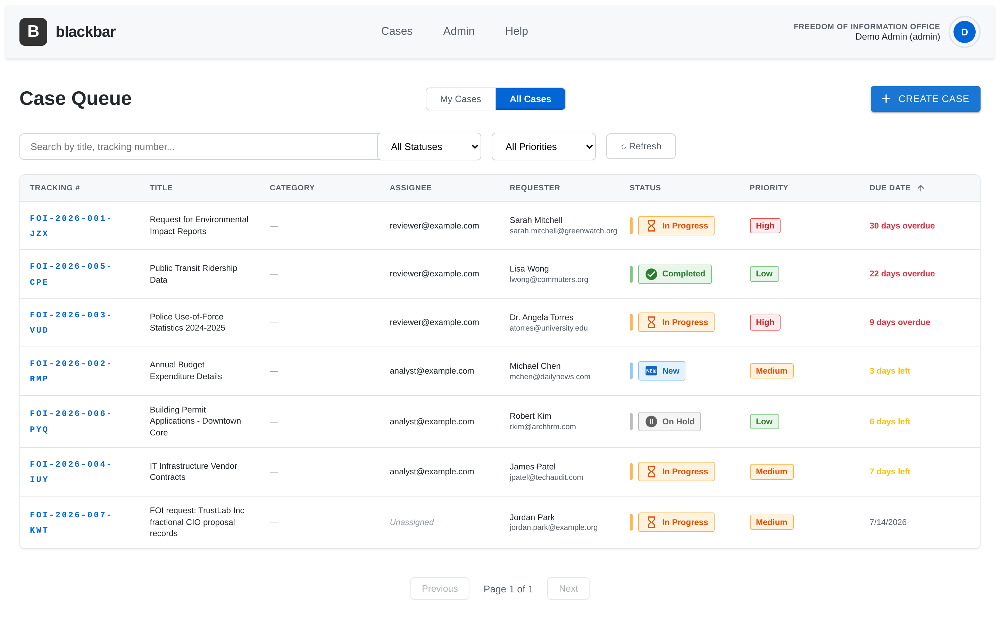
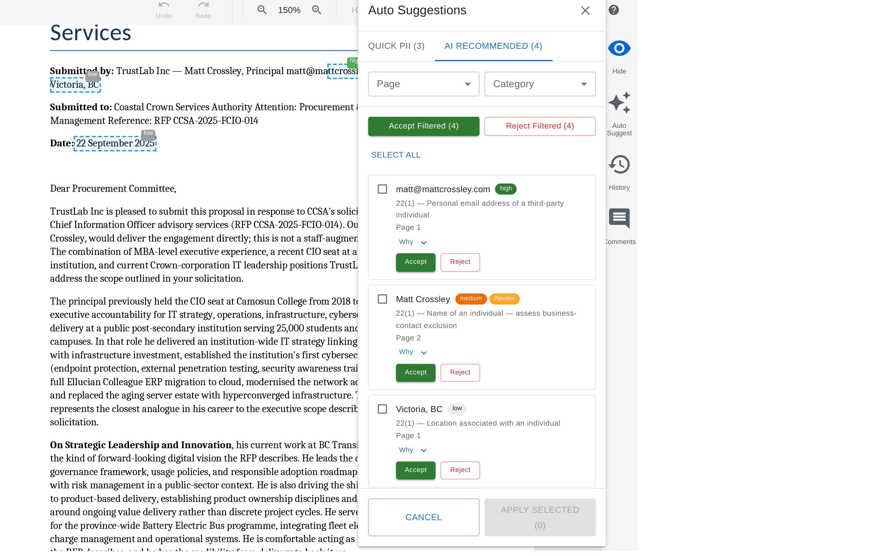
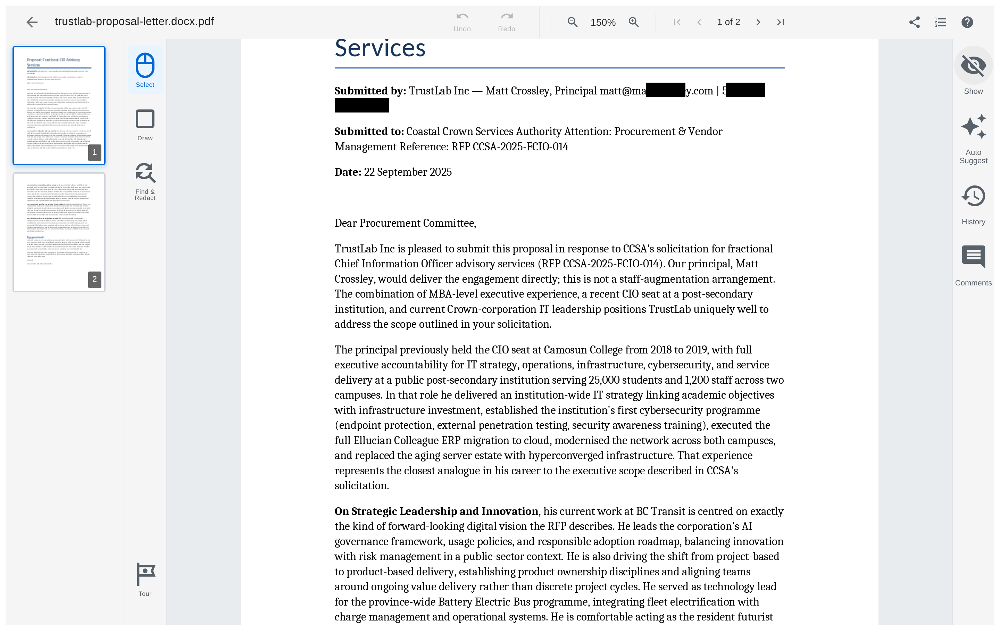

# BlackBar

[](https://github.com/blackbar/blackbar/actions/workflows/backend-ci.yml)
[](https://github.com/blackbar/blackbar/actions/workflows/frontend-ci.yml)
[](https://github.com/blackbar/blackbar/actions/workflows/container.yml)
[](https://github.com/blackbar/blackbar/releases)
[](LICENSE)
[](backend/pyproject.toml)
[](frontend/package.json)

<!--
Badges resolve against the placeholder `blackbar/blackbar` repo slug.
When the new GitHub org is spun up, update `blackbar/blackbar` to match
the actual `<owner>/<repo>` path. Codecov badges are intentionally
deferred — the `${{ secrets.CODECOV_TOKEN }}` secret has not been issued
yet; once it is, the upload steps in backend-ci.yml and frontend-ci.yml
can be uncommented and a Codecov badge added here.

Secrets to configure on the new org once it exists:
  - CODECOV_TOKEN   (optional, for coverage uploads)
  - GITHUB_TOKEN    (auto-provisioned, used by container.yml publish job)
-->

BlackBar is an open-source Freedom of Information (FOI) case management and document redaction system. It provides a complete workflow for handling information requests, from intake through document review, redaction, and release. Designed with BC FIPPA compliance in mind, BlackBar is jurisdiction-agnostic through configurable privacy packs.

Licensed under Apache 2.0. Self-hosted, single-tenant deployment via Docker Compose.

## Key Features

### Case Management
- Complete case lifecycle tracking from creation to closure
- Customizable statuses, priorities, and categories
- Team assignment with per-case role-based permissions
- Public request portal for FOI submissions
- Unique tracking numbers for request progress

### Document Management
- Multi-format support: PDF, DOCX, PPTX, XLSX, EML, MSG
- Automatic conversion to PDF via LibreOffice
- OCR text extraction via Tesseract
- Bulk upload and processing
- 8-stage document status workflow
- Content hash-based deduplication
- Email thread consolidation to avoid redundant review

### Redaction Tools
- **Select Tool** -- native text selection with automatic coordinate detection and multi-line support
- **Draw Tool** -- freeform rectangle drawing for non-text areas (images, tables, margins)
- **Find and Redact** -- real-time search with batch redaction from OCR results
- Interactive PDF viewer with click-to-select redactions, 8-handle resize, and drag-to-move
- Click-to-view redaction details (category, section, author, timestamp)
- Color-coded overlays: blue for user redactions, green for AI suggestions
- Pack-based redaction categories with jurisdiction-specific section mapping
- Export final redacted PDFs for release

### AI Integration
- Configurable LLM provider: supports OpenAI, Anthropic, Google, and Cohere
- Document summarization
- AI-powered PII detection and redaction suggestions
- **Optional** Presidio-based rule-based PII detection — integrated but **disabled by default**. Re-enabling it requires adding `presidio-analyzer` to `pyproject.toml`, installing the matching spaCy model, and wiring the analyzer into the suggestion pipeline; see `backend/src/utils/pii_detection.py` for the inert-mode guard.
- Suggestion caching to minimize API calls

### User Management
- **4-tier system roles:** `admin / analyst / user / guest` (defined in `backend/src/auth/roles.py`)
- **Separate 7-tier case-team taxonomy** for per-case permissions: `manager / analyst / legal / sme / reviewer / approver / third_party` (defined in `backend/src/cases/permissions.py`)
- The system "analyst" and case-team "analyst" share a name but are distinct concepts; see [`docs/standards/ROLES.md`](docs/standards/ROLES.md) for the canonical write-up.
- JWT authentication (PyJWT) with `public` / `org` / `admin` realms
- bcrypt password hashing
- Configurable session timeouts
- Audit logging of all user actions

### System Configuration
- Organization branding (logo, colors, name)
- Workflow defaults (due dates, assignees, priorities)
- Customizable request categories
- Public portal controls
- Security settings (session timeout, password requirements)

### Reporting
- Case statistics (open, closed, overdue)
- Document processing metrics
- Complete audit trail
- Release package generation

> **Roadmap items, not shipping in 0.1.0:**
> - Response-letter generation (`POST /cases/{case_id}/generate-letter`) currently returns HTTP 501. The endpoint is in place; the implementation is pending.

## Screenshots

| Case queue | AI redaction suggestions | Redacted preview |
|:---:|:---:|:---:|
| [](docs/screenshots/04-case-queue.png) | [](docs/screenshots/08-ai-suggestions.png) | [](docs/screenshots/12-redacted-view.png) |

See the full tour — requester portal, document viewer, email-thread
deduplication, manual redaction, release packages — in
[**docs/screenshots/**](docs/screenshots/). Regenerate with
[`scripts/demo_screenshots.sh`](scripts/demo_screenshots.sh).

## Quick Start

### Prerequisites

- Docker and Docker Compose v2 (`docker compose`, not the legacy `docker-compose`)
- `openssl` (used by `setup.sh` to generate secrets)

### Installation

1. Clone the repository:
   ```bash
   git clone https://github.com/blackbar/blackbar.git
   cd blackbar
   ```
   <!-- TBD: the `blackbar` GitHub org is pending. Until then the canonical URL may differ. -->

2. Run the setup script:
   ```bash
   bash setup.sh
   ```
   The script will:
   - Generate `MONGO_PASSWORD`, `JWT_SECRET`, and `LLM_API_KEY_ENCRYPTION_KEY` into `.env` if not already set
   - Prompt for an admin email and password (or read `ADMIN_EMAIL` / `ADMIN_PASSWORD` from the environment)
   - Start MongoDB and the backend
   - Create the admin user, seed default templates, and write baseline system configuration
   - Optionally seed three demo users plus sample cases (you opt in at the prompt)
   - Optionally seed the TrustLab Inc / CCSA FOI demo case for end-to-end walkthroughs (separate prompt; see [`tests/manual-test-files/trustlab-foi/README.md`](tests/manual-test-files/trustlab-foi/README.md))
   - Write all initial passwords to `INITIAL_CREDS.txt` (mode `600`, gitignored)
   - Start the frontend

3. Access BlackBar at `http://localhost:3000` and log in with the admin credentials you provided.

4. Copy the credentials from `INITIAL_CREDS.txt` to your password manager and **delete the file** before exposing the deployment to production traffic. See [`SETUP_GUIDE.md`](SETUP_GUIDE.md) for the full flow.

## Testing

### Backend (pytest + testcontainers)

```bash
cd backend
pip install -e ".[dev]"
pytest
```

Coverage gate: **≥80%** lines (`fail_under = 80` in `backend/pyproject.toml`).

### Frontend (Vitest)

```bash
cd frontend
npm install
npm run test:run         # one-shot
npm run test             # watch mode
npm run test:coverage    # with coverage report
```

Coverage gate: **≥70%** lines/statements, ≥65% functions/branches (`vite.config.ts`).

## Technology Stack

| Layer | Technology | Purpose |
|-------|------------|---------|
| Frontend | React 18 + TypeScript 5.6 | UI framework |
| | Vite 5 | Build tooling and dev server |
| | Vitest 2 | Test runner |
| | Material-UI 5 | Component library |
| | React-PDF / pdfjs-dist | PDF rendering (redaction overlays are positioned divs, not canvas) |
| Backend | FastAPI (Python 3.11+) | REST API |
| | Motor | Async MongoDB driver |
| | PyJWT | JWT signing/verification (replaces python-jose) |
| | PyMuPDF | PDF manipulation |
| | Tesseract OCR | Text extraction |
| | LibreOffice | Document conversion |
| | Presidio | Optional rule-based PII detection (disabled by default) |
| Database | MongoDB 5 | Document storage |
| AI/ML | OpenAI, Anthropic, Google, Cohere | Configurable LLM providers |
| Infrastructure | Docker Compose v2 | Containerized deployment |

## Architecture

BlackBar runs as three Docker Compose services:

| Service | Description | Default Port |
|---------|-------------|--------------|
| frontend | React SPA served via Nginx | 3000 |
| backend | FastAPI application | 8000 |
| mongodb | MongoDB 5 database | 27017 (bound to 127.0.0.1) |

All data is stored in a single MongoDB database. The backend handles authentication, document processing, OCR, AI integration, and PDF generation. The frontend provides the case management interface, document viewer, and redaction canvas.

For deeper architecture detail see [`docs/architecture/ARCHITECTURE.md`](docs/architecture/ARCHITECTURE.md) and [`docs/architecture/SYSTEM_OVERVIEW_DIAGRAM.md`](docs/architecture/SYSTEM_OVERVIEW_DIAGRAM.md).

## Documentation

- [Setup Guide](SETUP_GUIDE.md) — end-to-end installation and operations
- [Docker Commands](DOCKER_COMMANDS.md) — Docker Compose cheatsheet
- [Documentation Index](DOCUMENTATION_INDEX.md) — full map of the docs
- [Architecture Overview](docs/architecture/ARCHITECTURE.md)
- [Developer Quick Start](docs/guides/DEVELOPER_QUICK_START.md)
- [Contributing](CONTRIBUTING.md)
- [Security Policy](SECURITY.md)
- [Changelog](CHANGELOG.md)

## Contributing

Contributions are welcome — see [`CONTRIBUTING.md`](CONTRIBUTING.md) for the dev setup, branch/commit conventions, test requirements, and DCO sign-off policy.

## License

BlackBar is licensed under the [Apache License, Version 2.0](LICENSE).

You are free to use, modify, and distribute this software under the terms of the Apache 2.0 licence, including in commercial and proprietary products. See the LICENSE file for the full terms and the patent grant.

## Security

To report a vulnerability, see [`SECURITY.md`](SECURITY.md). Please do **not** open public issues for security reports.

## Support

- Open an issue on GitHub (non-security topics only)
- Check the in-app Help Guide
- Review the documentation linked above
