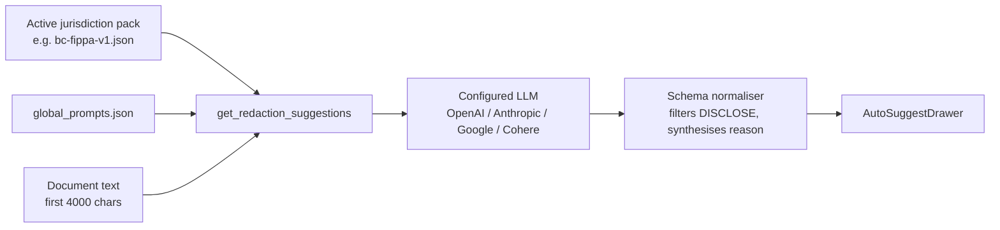

# BlackBar AI Prompt System

How AI redaction suggestions are produced — pack structure, prompt flow, and
the output schema the viewer consumes.

---

## Overview

BlackBar runs **one LLM call per document** to produce a list of redaction
suggestions. The prompt is assembled from two sources:

1. A jurisdiction pack (`backend/packs/<jurisdiction>.json`) that describes
   the legal context, exemption categories, and the prompt text itself.
2. Global principles (`backend/packs/global_prompts.json`) that apply
   across all jurisdictions.

The active pack is selected by `src.packs.loader.get_active_pack()` and
cached at module load. Currently active by default: `bc-fippa-v1.json`
(BC FIPPA v2 pack structure).



Code entry point: [`backend/src/utils/ai_redaction.py::get_redaction_suggestions`](../../backend/src/utils/ai_redaction.py).

---

## Pack shapes

Two pack shapes are supported (BlackBar dispatches on which keys are
present):

### Single-pass legacy (`ai_prompts.redaction_analysis`)

Used by `ontario-mfippa-v1.json`. One prompt produces a list of redaction
suggestions in a flat schema.

```jsonc
{
  "ai_prompts": {
    "redaction_analysis": {
      "system_prompt": "You are an FOI analyst...",
      "user_prompt_template": "Analyse this document... {document_text}",
      "temperature": 0.2,
      "max_tokens": 2000
    }
  }
}
```

### Single-shot classification (`ai_prompts.classification_pass`)

Used by `bc-fippa-v1.json` (BC FIPPA v2 onwards). The pack ships an
optional `detection_pass` for documentation, but BlackBar currently runs
classification as a single LLM call — the prompt itself does both
detection and classification inline.

```jsonc
{
  "ai_prompts": {
    "detection_pass": {                 // documented; not currently invoked
      "name": "Detection Pass",
      "purpose": "Identify candidate items for downstream classification.",
      "system_prompt": "...",
      "temperature": 0.2,
      "max_tokens": 3000
    },
    "classification_pass": {
      "name": "Classification Pass",
      "purpose": "Apply FIPPA exemption analysis...",
      "system_prompt": "...rich rule-based instructions...",
      "user_prompt_template": "...{document_text}\n{candidates}...",
      "temperature": 0.2,
      "max_tokens": 3000
    }
  }
}
```

The dispatch logic prefers `redaction_analysis` if present (legacy
behaviour), otherwise `classification_pass`. The `{candidates}` placeholder
is substituted to an empty string in single-shot mode.

> **History note.** A true two-pass orchestration (detection LLM call →
> candidate JSON → classification LLM call with candidates injected) was
> implemented in `91e810b` and reverted in `0f62d32` because the doubled
> latency (≈30–50s per doc) wasn't worth the recall improvement given
> how often operators iterate on prompts. The pack still carries the
> `detection_pass` definition for the option to revive it.

---

## The BC FIPPA v2 classification prompt

The prompt is structured as a hierarchy of rules. Operators tuning the
pack should preserve this shape because the model relies on it.

### STEP 0 — Identify the record type first

Before classifying any item, the model is asked to recognise the record
type. This routes each item to a sensible default category:

| Record type | Default category | Example |
|---|---|---|
| INTERNAL DELIBERATION | s.13 | Committee minutes, evaluation memos, briefing notes |
| OPERATIONAL RECORD | disclose | Contracts, invoices, registers |
| THIRD-PARTY RECORD | s.22 | Records about a service recipient |
| CORRESPONDENCE | per content | Emails, letters |

Without this, the model defaults every item to s.22 because items
mention people.

### REDACT list

Explicit allow-list. The prompt enumerates exactly what triggers each
exemption:

- Personal contact details (home address, personal phone, personal email,
  date of birth)
- Government identifiers (SIN, driver's licence, passport, health card,
  banking)
- s.22(3) presumed-invasion **closed list** — paragraphs (a) through (i)
  enumerated explicitly so the model can't extend it
- Other exemptions: s.13 (advice), s.14 (privilege), s.15-21 (with
  articulated harm), s.22.1 (abortion services)

### NEVER REDACT list

Hard deny-list, including:

- Names of anyone in a business or professional capacity
- **Vendor principals** in procurement records ("the principal of a
  one-person consultancy is no more redactable than the CEO of a large
  corporation")
- Organisation names — ever
- Work titles, work emails, office phones, business addresses
- Public officials' names + titles in official capacity
- Anything already public (LinkedIn, org charts, annual reports)
- Vendor name + total contract value on completed procurements (s.22(4)(e))
- Professional opinions, performance assessments, capacity judgments —
  these are s.13 if anything, never s.22

### Names — the special rule

> A name is NOT automatically personal information. The default for any
> name is DISCLOSE.

Three narrow exceptions:

1. Name appears in a candid third-party assessment of that named person
   (reference check, performance evaluation).
2. Name is bundled with sensitive personal info about that person in the
   same sentence.
3. Name identifies a person receiving services (income assistance, health,
   social services).

### s.13 vs s.22 disambiguation

A standalone block at the bottom of the prompt that ties STEP 0 back to
the cascade: deliberative records → s.13, even when they quote named
officials or discuss named individuals.

### Forbidden reasoning patterns

Explicit anti-examples the model is told to refuse:

- *"The name identifies an individual, therefore s.22 applies."* — WRONG
- *"s.22(3) applies because this is personal information."* — WRONG
- *"This could lead to identification of the person."* — WRONG (speculative
  inference)
- *"Balancing under s.22(2) favors privacy"* without articulating a
  specific privacy harm. — WRONG
- *"This quote is from a named individual, so s.22 applies."* — WRONG
  (quoted opinion in a deliberative record is s.13)
- *"Mention of an individual's current employment could lead to
  identification."* — WRONG (employer names are public)

This list grew empirically: every entry corresponds to a specific
rationalisation the model produced on a real document.

---

## Output schema

The classification pass returns a JSON array. Each item:

```jsonc
{
  "text": "exact text from the document",
  "category": "S22" | "S13" | "S14" | "S15" | "S17" | "S21" | "S22.1",
  "section_subsection": "s.22(3)(a)",   // required when claiming s.22(3)
  "confidence": "high" | "medium" | "low",
  "page": 1,
  "reasoning_chain": ["short bullet 1", "short bullet 2"],  // optional; omitted for obvious redactions
  "harm_identified": "...",              // optional; harm-based exemptions
  "severance_note": "why this exact span", // optional
  "exceptions_considered": ["s.22(4)(e)"], // optional
  "public_interest_override_flag": false,  // optional
  "requires_human_review": true            // optional; for low-confidence or multi-exemption cases
}
```

The model is also instructed to skip `DISCLOSE` audit entries — the
normaliser in `ai_redaction.py` filters any that do slip through so the
UI only shows real redactions.

### Confidence calibration

| Level | Meaning |
|---|---|
| `high` | Exemption test clearly met; would survive OIPC review |
| `medium` | Exemption test met but counter-arguments exist (s.22(4), s.25, severability, exception applies) |
| `low` | Candidate identified but exemption basis unclear — flag for human review; do NOT auto-apply |

---

## Frontend integration

The `AutoSuggestDrawer` ([`frontend/src/components/viewer/AutoSuggestDrawer.tsx`](../../frontend/src/components/viewer/AutoSuggestDrawer.tsx))
renders suggestions and surfaces the rich schema:

- Header shows `section_subsection` when present, falls back to `category`
- **Review** badge (orange) when `requires_human_review === true`
- **s.25?** badge (purple) when `public_interest_override_flag === true`
- **Why** expander reveals `reasoning_chain`, `harm_identified`,
  `severance_note`, `exceptions_considered`

Legacy packs (Ontario MFIPPA) that only return `text + category + reason +
confidence` render with no expander and no badges.

### Generate vs Regenerate

- **Generate AI Suggestions** (first call on a doc without cached results)
  — normal fetch; cache miss triggers an LLM call.
- **Regenerate** — passes `?force_regenerate=true`, which forces the
  backend to skip the cached `ai_suggestions` field on the document and
  call the LLM again. Use this after editing a pack to see prompt changes
  reflected.

The cache lives in the document's `ai_suggestions` field in MongoDB.

---

## Tuning the prompt

Pack edits are picked up at backend startup (the active pack is cached
at module load). After editing `bc-fippa-v1.json`:

```bash
docker compose restart backend
```

Then clear the cached suggestions on the documents you want to re-test:

```bash
docker compose exec -T mongodb mongosh "$MONGODB_URI" --quiet --eval "
db.documents.updateMany({}, {\$unset: {ai_suggestions: ''}})
"
```

Or just hit **Regenerate** in the UI on each doc you want to refresh.

When iterating, watch for:

- The model citing rules and then ignoring them ("reasoning theatre"). If
  the reasoning chain references the right rule but the conclusion
  contradicts it, the rule needs to be stronger, not longer. Consider
  adding an explicit forbidden-pattern entry.
- Over-redaction of names — the most common failure mode. The default is
  DISCLOSE; tighten the NAMES rule rather than adding cascading checks.
- Wrong section category (e.g. s.22 instead of s.13). Usually fixed by
  strengthening the STEP 0 record-type framing for that document shape.

---

## Adding a new jurisdiction pack

1. Copy `bc-fippa-v1.json` to `<jurisdiction>-<id>.json` in
   `backend/packs/`.
2. Update `pack_id`, `name`, `jurisdiction`, `redaction_categories` (with
   the correct section codes), `interpretation_rules`, and the
   `ai_prompts.classification_pass.system_prompt` content.
3. Activate via `set_active_pack()` in `src.packs.loader`, or by editing
   the default in `get_active_pack()`.

Each pack is self-contained — there's no per-jurisdiction code in
`src/`. New jurisdictions are a pack edit, not a code change.
