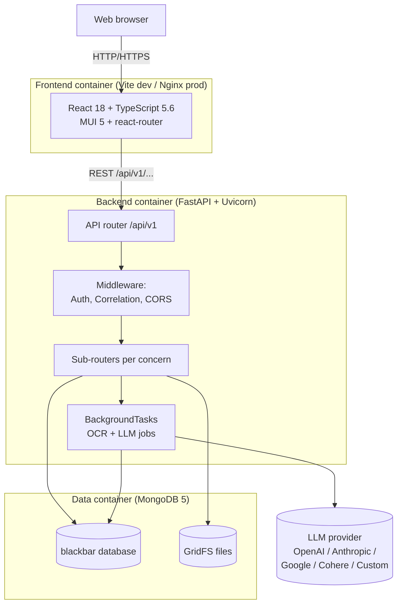
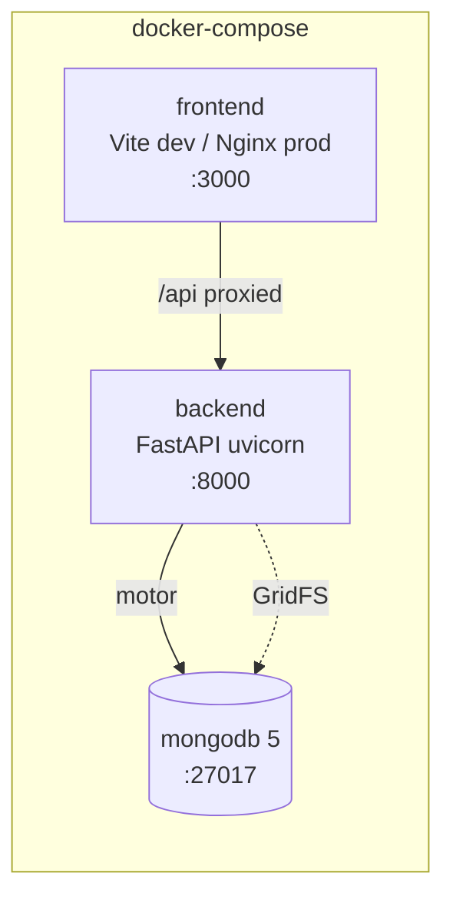

# BlackBar System Architecture

**Status:** Active
**Applies to:** `0.1.x` (post-Phase-1 single-tenant cleanup)

BlackBar is a self-hosted, single-tenant Freedom of Information (FOI) document
redaction and case-management system. It is distributed under Apache 2.0
and deployed via Docker Compose.

---

## 1. High-level architecture



- **Single tenant.** There is one MongoDB database (`blackbar`). No
  per-tenant databases, no subdomain routing, no `tenant_id` filters.
- **One backend service.** A single FastAPI app exposes all routes under
  `/api/v1`. Background tasks run in the same process via FastAPI's
  `BackgroundTasks`.
- **One MongoDB instance** with GridFS for document binaries.
- **LLM access is optional** and configured at runtime via the admin UI.

---

## 2. Repository layout

```
blackbar/
├── backend/                      FastAPI app
│   └── src/
│       ├── main.py               Router wiring + middleware
│       ├── auth/                 JWT + bcrypt, magic links, activation
│       ├── cases/                Decomposed case routers (see §3)
│       ├── documents/            Decomposed document routers (see §3)
│       ├── workflow/             Statutory clock, contributors, queue
│       ├── admin/                System config + LLM admin
│       ├── llm/                  LLM provider configs + Fernet encryption
│       ├── users/                Internal user model + repository
│       ├── public_users/         Magic-link contributor user model
│       ├── teams/                Organizational teams
│       ├── categories/           Request categories
│       ├── packs/                Jurisdiction packs
│       ├── templates/            Letter templates
│       ├── core/                 Middleware, telemetry, indexes
│       └── utils/                Conversion, OCR, AI, redaction
├── frontend/                     React 18 + TS 5.6 + Vite 5
│   └── src/
│       ├── components/           Feature-area components
│       ├── pages/                Route-level pages
│       ├── api/, services/       Axios client + service wrappers
│       └── contexts/             Auth, User contexts
├── docker-compose.yml            Dev compose (3 services)
├── docker-compose.prod.yml       Production compose
└── docs/                         Documentation
```

---

## 3. Router decomposition

`cases/routes.py` and `documents/routes.py` are deliberately thin —
each domain is split across focused sub-routers wired in
`backend/src/main.py`:

### Cases

| Router file                              | Concern                              |
|------------------------------------------|--------------------------------------|
| `cases/routes.py`                        | Core CRUD + team membership          |
| `cases/queue_routes.py`                  | Listing / filtering / queue          |
| `cases/collection_link_routes.py`        | Anonymous upload links               |
| `cases/release_routes.py`                | Release-package generation           |
| `cases/team_routes.py`                   | Case-team management                 |
| `cases/approval_routes.py`               | Proposal review + approval flow      |
| `cases/public_routes.py`                 | Unauthenticated public-portal routes |
| `cases/status_routes.py`                 | Status / priority / timeline enums   |

### Documents

| Router file                                       | Concern                          |
|---------------------------------------------------|----------------------------------|
| `documents/routes.py`                             | Upload + metadata + listing      |
| `documents/redaction_routes.py`                   | Redaction CRUD                   |
| `documents/redaction_suggestion_routes.py`        | AI suggestion fetch + feedback   |
| `documents/attachment_routes.py`                  | Email attachment access          |
| `documents/document_status_routes.py`             | Status transitions               |
| `documents/search_routes.py`                      | Full-text search                 |
| `documents/share_routes.py`                       | Shared-document access           |
| `documents/contest_routes.py`                     | Contesting professional redactions |

### Other top-level routers

`auth`, `auth/magic_link`, `auth/activation`, `categories`, `teams`,
`admin`, `admin/config`, `admin/llm`, `packs`, `templates`,
`workflow`. The `workflow` router covers the statutory clock,
contributors, messaging, reminders, transfers, and the priority queue.

All routers are mounted under `/api/v1`. A separate `/metrics` endpoint
(Prometheus exposition) is mounted at the root.

---

## 4. Middleware stack

Middleware order matters because Starlette executes them in reverse-add
order. The current stack (from `main.py`):

1. **CORSMiddleware** (outermost) — restricts origins to `ALLOWED_ORIGINS`
   from env.
2. **CorrelationMiddleware** — generates / propagates `X-Correlation-ID` and
   records request metrics.
3. **AuthMiddleware** (innermost) — validates bearer JWTs, attaches
   `request.state.user_id` and `request.state.roles`. Maintains an
   allowlist of public routes (see `SECURITY_ARCHITECTURE.md`).
4. **Security headers** — applied per response as an HTTP middleware:
   `X-Content-Type-Options`, `X-Frame-Options: DENY`,
   `Strict-Transport-Security`, baseline CSP.

There is **no `TenantMiddleware`** any longer. It was removed in the
single-tenant cleanup along with `tenant_database.py`.

---

## 5. Authentication and authorization

### JWT realms (post-Phase-1.7)

Three realms only — `tenant` was removed:

| Realm    | Issued to                                     | Source                                |
|----------|-----------------------------------------------|---------------------------------------|
| `admin`  | Internal users whose role is `admin`          | `auth/auth_service.py: issue_token`   |
| `org`    | All other internal users (`analyst/user/guest`) | Same                                |
| `public` | Magic-link contributors (`public_users`)      | `auth/magic_link_service.py`          |

### User roles (4-tier)

Defined in `auth/roles.py`:

| Role     | Level | Purpose                                                  |
|----------|------:|----------------------------------------------------------|
| admin    | 4     | Full system access — users, config, all cases            |
| analyst  | 3     | FOI staff — create/manage cases, view all cases          |
| user     | 2     | Limited staff — view assigned cases                      |
| guest    | 1     | External — view explicitly-invited cases                 |

### Case-team roles (7-tier, per case)

Defined in `cases/permissions.py`. These exist in parallel to user
roles and apply only within a single case's `case_team` array:

`manager`, `analyst`, `legal`, `sme`, `reviewer`, `approver`,
`third_party`.

Note: `analyst` exists in both taxonomies. See
[`docs/standards/ROLES.md`](../standards/ROLES.md) (Batch 4.5) for the
detailed reconciliation.

---

## 6. Persistence

### MongoDB

One database, named `blackbar` by default. Collections include:

- `users` — internal user accounts
- `public_users` — magic-link contributors
- `magic_link_tokens` — single-use auth tokens
- `cases` — case documents (with embedded `audit_log`, `case_team`,
  `comments`, `document_ids`)
- `documents` — document metadata (binaries live in GridFS)
- `categories`, `teams`, `packs`, `templates`
- `clock_events`, `case_contributors`, `case_messages`, `case_reminders`,
  `case_transfers` (workflow module)
- `system_config`, `llm_configs`

See [`DATA_MODELS.md`](DATA_MODELS.md) for full schema diagrams.

### GridFS

Used by `DocumentProcessingService` to store document binaries
(originals + canonical PDFs) so they bypass MongoDB's 16 MB document
limit. References are stored on the document record as
`content_file_id` and `original_file_id`. See
[`DOCUMENT_PROCESSING.md`](DOCUMENT_PROCESSING.md).

---

## 7. Document processing pipeline

`DocumentProcessingService` (in `backend/src/documents/processing_service.py`)
is the single entry point for every upload — authenticated routes,
collection-link routes, and contributor routes all funnel through it.

High level:

```
validate -> hash-dedupe -> convert-to-PDF -> message-id-dedupe (emails)
        -> OCR + coordinates -> optional AI summary
        -> GridFS write -> document record insert
        -> attachment processing -> email-thread consolidation
        -> background AI suggestion task (if enabled)
```

Conversion uses **LibreOffice** for DOCX/PPTX/XLSX, a custom EML/MSG
parser, and PIL for images. Text is extracted with PyMuPDF, with
Tesseract OCR as fallback for image-only PDFs. See
[`DOCUMENT_PROCESSING.md`](DOCUMENT_PROCESSING.md) for the full flow.

---

## 8. LLM integration

LLM providers are not configured via env vars in the runtime path —
they're managed at runtime through the admin UI and stored in the
`llm_configs` MongoDB collection. API keys are encrypted at rest with
Fernet, using the `LLM_API_KEY_ENCRYPTION_KEY` env var (see
`backend/src/llm/encryption.py`).

Supported request formats: OpenAI, Anthropic, Google, Cohere, plus a
generic `custom` format for OpenAI-compatible endpoints. Exactly one
LLM config must be marked as the global default (stored in
`system_config.default_llm_id`); the first enabled config created is
auto-promoted to default to avoid the "config exists but AI features
say not configured" trap.

Two LLM-driven features:

- **AI redaction suggestions** — one LLM call per document. Uses a
  pack-driven prompt system: a jurisdiction pack (e.g.
  `bc-fippa-v1.json`) supplies the legal context and prompt text; a
  global prompts file (`global_prompts.json`) supplies universal
  principles. The current BC FIPPA v2 pack uses a single-shot
  classification prompt with a STEP 0 record-type framing and
  explicit allow/deny lists. See
  [`docs/api/AI_PROMPT_SYSTEM.md`](../api/AI_PROMPT_SYSTEM.md) for
  the prompt shape, output schema, and tuning guidance. Opt-in per
  system via `system_config.auto_generate_ai_suggestions` — runs as a
  FastAPI `BackgroundTask` after upload when enabled; otherwise on
  manual trigger from the viewer.
- **Document summaries** — same opt-in setting.

The AI redaction pipeline normalises the rich output schema
(`section_subsection`, `reasoning_chain`, `severance_note`,
`requires_human_review`, `public_interest_override_flag`) into a
flat shape the frontend can render uniformly across pack versions.
`DISCLOSE` entries (audit-trail items the model decided NOT to redact)
are filtered before the suggestions reach the UI.

Presidio-based rule-based PII detection is deactivated by default.
The module (`utils/pii_detection.py`) is retained so operators can
re-enable it after installing `presidio-analyzer`.

---

## 9. Observability

All three providers are opt-in via env vars and initialised in
`core/telemetry.py`:

| Provider          | Env var                              | Purpose                |
|-------------------|--------------------------------------|------------------------|
| OpenTelemetry     | `OTEL_EXPORTER_OTLP_ENDPOINT`        | Distributed traces     |
| Sentry            | `SENTRY_DSN`                         | Error tracking         |
| Prometheus        | mounted at `/metrics`                | Metrics scraping       |

Structured logging is configured in `core/logging_config.py`. Every
request gets a correlation ID via `CorrelationMiddleware`; all log
records include it.

---

## 10. Frontend

- React 18, TypeScript 5.6, Vite 5 build (no CRA).
- MUI 5 for components.
- `react-pdf` for PDF rendering; redaction overlays are positioned
  divs over the rendered page (not canvas), so they support hover,
  click, drag, and per-handle resize natively. Coordinate conversion
  between PDF page space and screen pixels lives in
  `frontend/src/components/viewer/coordinates.ts` (unit-testable, no
  DOM).
- Axios for HTTP; bearer tokens stored in localStorage.
- Vitest for tests (no Jest).
- Coverage gate: 70%.

The redaction viewer (`components/viewer/`) supports:

- Click-to-select with 8 resize handles (corners + edges) on the
  selected box
- Drag-to-move on the body of a selected box (movement threshold
  disambiguates from click-to-open-menu)
- Esc closes the action menu; Esc-again deselects
- Live coordinate override during drag/resize so the box tracks the
  cursor, persisted via `PUT /redactions/{id}/edit` on mouse-up

Top-level routes are gated by `ProtectedRoute` which checks the user's
realm and role before rendering. Public routes (`/request`, `/track`,
`/collect/:token`, `/contribute/:id`) are accessible without auth.

---

## 11. Deployment



- Dev: `docker-compose.yml` — three services (`frontend`, `backend`,
  `mongodb`) on the `blackbar-network` bridge.
- Production: `docker-compose.prod.yml` parameterises the data
  directory via `BLACKBAR_DATA_DIR`.
- `setup.sh` bootstraps `.env` and writes an initial admin password to
  `INITIAL_CREDS.txt`.

See the repo-root [`README.md`](../../README.md) for the operator
quick-start (Docker prerequisites, ports, default URLs).

---

## 12. Technology summary

| Layer    | Technology                                          |
|----------|-----------------------------------------------------|
| Frontend | React 18, TypeScript 5.6, Vite 5, MUI 5, Vitest     |
| PDF      | react-pdf, pdfjs-dist (redaction overlays are positioned divs) |
| Backend  | FastAPI, Python 3.11+, Motor (async MongoDB)        |
| Auth     | PyJWT, bcrypt                                       |
| Docs     | PyMuPDF, Tesseract OCR, LibreOffice, extract-msg    |
| Crypto   | cryptography (Fernet for LLM keys)                  |
| DB       | MongoDB 5 + GridFS                                  |
| Obs.     | OpenTelemetry, Sentry, Prometheus (all opt-in)      |
| Container| Docker, Docker Compose                              |
| Tests    | pytest + testcontainers (backend ≥80%), Vitest (frontend ≥70%) |

Note: `python-jose` was replaced with `PyJWT`; React 18 + Vite replaced
the previous CRA setup; Presidio is currently deactivated.

---

## 13. Related documentation

- [`DATA_MODELS.md`](DATA_MODELS.md) — collection schemas and ER diagrams
- [`DOCUMENT_PROCESSING.md`](DOCUMENT_PROCESSING.md) — upload pipeline
- [`SECURITY_ARCHITECTURE.md`](SECURITY_ARCHITECTURE.md) — auth, RBAC,
  threat model
- [`SYSTEM_OVERVIEW_DIAGRAM.md`](SYSTEM_OVERVIEW_DIAGRAM.md) — single
  consolidated system diagram
- [`AGENTIC_REDACTION_PIPELINE.md`](AGENTIC_REDACTION_PIPELINE.md) —
  design proposal for an agent-shaped evolution (not implemented)
