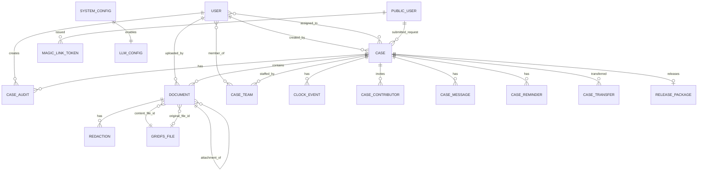
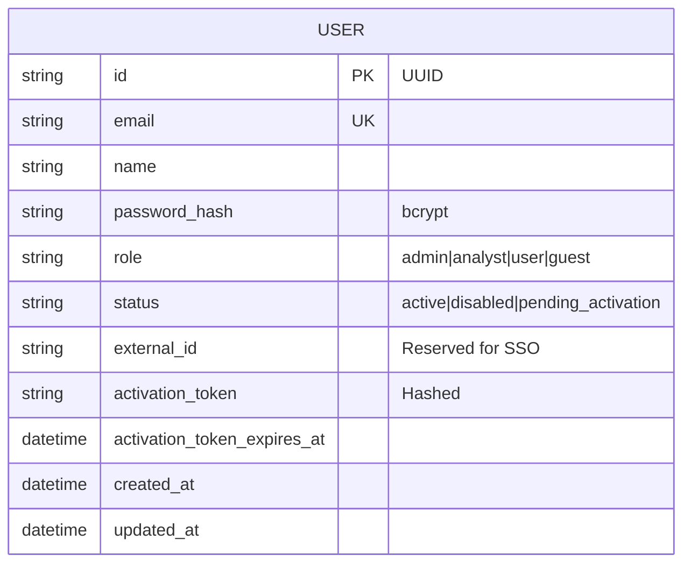
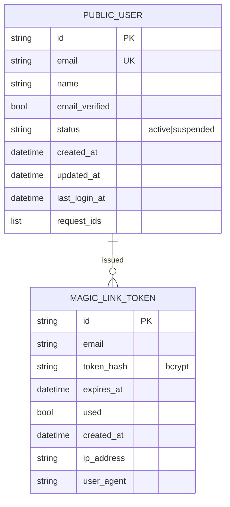
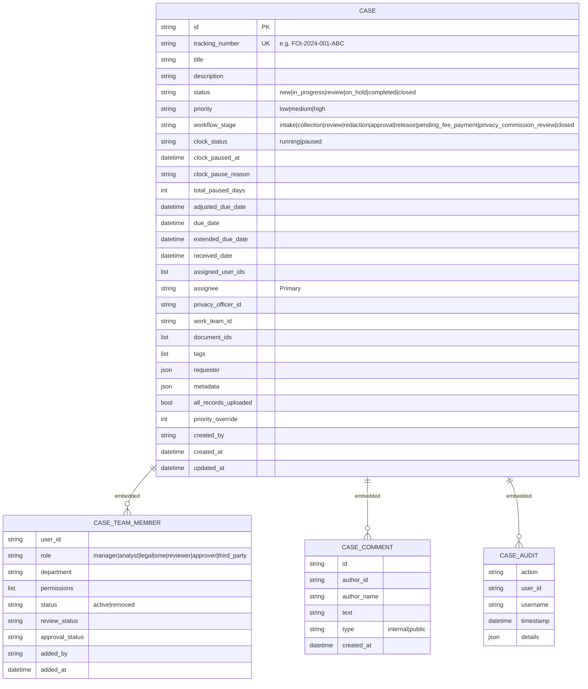
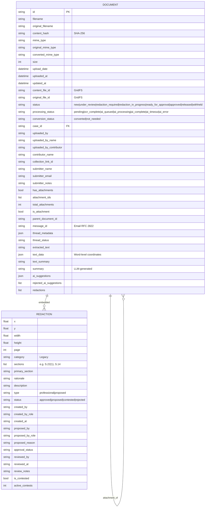
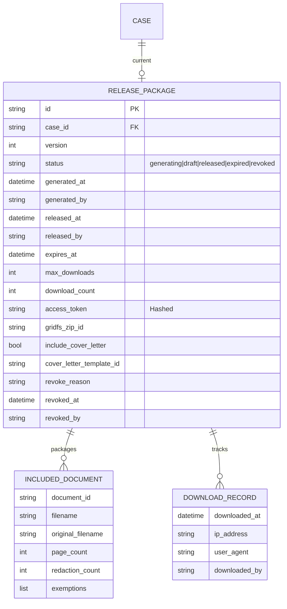
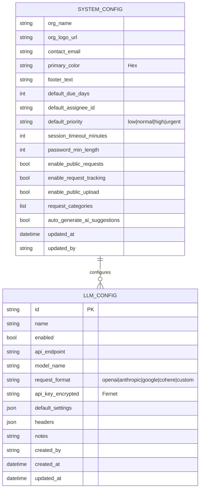

# Data Models

**Status:** Active
**Applies to:** `0.1.x` (post-Phase-1 single-tenant cleanup)

BlackBar persists everything in a single MongoDB database named `blackbar`.
Document binaries (originals and converted PDFs) live in GridFS within
that same database; documents collections only carry references.

This doc maps the production Pydantic models to MongoDB collections.
**There is no `tenant_id` anywhere** — multi-tenancy was removed in
Phase 1 of the OSS prep. ID fields are application-level UUIDs (`id`);
MongoDB's `_id` is never used in application code.

---

## 1. Collections at a glance

| Collection            | Primary model                                       | Source                                      |
|-----------------------|-----------------------------------------------------|---------------------------------------------|
| `users`               | `User`                                              | `backend/src/users/models.py`               |
| `public_users`        | `PublicUser`                                        | `backend/src/public_users/models.py`        |
| `magic_link_tokens`   | `MagicLinkToken`                                    | `backend/src/public_users/models.py`        |
| `cases`               | `CaseDB`                                            | `backend/src/cases/models.py`               |
| `documents`           | document records (mixed-shape dict, see §4)         | `backend/src/documents/models.py` + service |
| `clock_events`        | `ClockEvent`                                        | `backend/src/workflow/models.py`            |
| `case_contributors`   | `CaseContributor`                                   | `backend/src/workflow/models.py`            |
| `case_messages`       | `CaseMessage`                                       | `backend/src/workflow/models.py`            |
| `case_reminders`      | `CaseReminder`                                      | `backend/src/workflow/models.py`            |
| `case_transfers`      | `CaseTransfer`                                      | `backend/src/workflow/models.py`            |
| `release_packages`    | `ReleasePackageDB`                                  | `backend/src/cases/release_package_models.py` |
| `system_config`       | `SystemConfiguration`                               | `backend/src/admin/config_models.py`        |
| `llm_configs`         | `LLMConfig` (API keys Fernet-encrypted)             | `backend/src/llm/models.py`                 |
| `categories`          | request categories                                  | `backend/src/categories/`                   |
| `teams`               | organizational teams                                | `backend/src/teams/`                        |
| `packs`               | jurisdiction packs                                  | `backend/src/packs/`                        |
| `templates`           | letter templates                                    | `backend/src/templates/`                    |

GridFS uses the standard `fs.files` / `fs.chunks` collections.

---

## 2. ER overview

`CASE_TEAM` and `CASE_AUDIT` are embedded arrays on the `cases`
document, not separate collections. `REDACTION` is an embedded array on
the `documents` document. They appear as separate entities here for
clarity.

---

## 3. User models

### `users` — internal staff

Source: `backend/src/users/models.py`. Roles are stored lowercase. The
`role` field is a flat string (not an enum on the model) but is
validated against `auth/roles.py: AVAILABLE_ROLES`.

### `public_users` — magic-link contributors

Source: `backend/src/public_users/models.py`. Public users have no
password; they authenticate by clicking single-use magic-link tokens
emailed to them (RFC-007).

---

## 4. Cases and embedded models

Source: `backend/src/cases/models.py`. `case_team`, `comments`, and
`audit_log` are stored as embedded arrays on the case document, not as
separate collections.

The `requester` JSON object on a case has shape
`{name, email, phone?, organization?}` (model: `Requester`).

---

## 5. Documents and redactions

The `documents` collection has a richer runtime shape than the slim
`DocumentDB` Pydantic model — `DocumentProcessingService` builds the
record directly as a dict. The effective schema:

Source: `backend/src/documents/models.py` (`RedactionBox`,
`DocumentStatus`) and the record builder in
`backend/src/documents/processing_service.py:_build_document_record`.

Notes:

- `text_data` is bounded by the service to 50 pages and 500K chars to
  stay under MongoDB's 16 MB document limit; truncation flips a
  `truncated: true` flag.
- Email attachments are stored as separate `DOCUMENT` rows with
  `is_attachment=true` and `parent_document_id` set.
- `ai_suggestions` caches LLM output; coordinates may be enriched
  lazily by the redaction-suggestion router.

---

## 6. Workflow collections

```mermaid
erDiagram
    CASE ||--o{ CLOCK_EVENT : has
    CASE ||--o{ CASE_CONTRIBUTOR : invites
    CASE ||--o{ CASE_MESSAGE : has
    CASE ||--o{ CASE_REMINDER : has
    CASE ||--o{ CASE_TRANSFER : transferred

    CLOCK_EVENT {
        string id PK
        string case_id FK
        string event_type "start|pause|resume|extend"
        string reason "fee_pending|scope_narrowing|third_party_consultation|privacy_commission_review|applicant_request|manual"
        datetime event_date
        string created_by
        string created_by_name
        string notes
        int days_elapsed_at_event
    }
    CASE_CONTRIBUTOR {
        string id PK
        string case_id FK
        string name
        string email
        string department
        string status "invited|active|completed|expired"
        string upload_token "Hashed"
        datetime token_expires_at
        int documents_uploaded
        datetime last_upload_at
        bool records_confirmed
        datetime records_confirmed_at
        string invited_by
        string invited_by_name
        datetime created_at
        datetime first_access_at
        datetime last_access_at
        datetime completed_at
        string notes
    }
    CASE_MESSAGE {
        string id PK
        string case_id FK
        string author_id
        string author_name
        string content
        list mentions
        datetime created_at
        datetime edited_at
    }
    CASE_REMINDER {
        string id PK
        string case_id FK
        string reminder_type "due_date|collection_deadline|fee_pending|review_not_started|package_not_generated|contributor_followup|custom"
        datetime trigger_date
        list recipient_ids
        string message
        string status "pending|sent|dismissed|cancelled"
        datetime sent_at
        list sent_via
        string created_by
        datetime created_at
        string dismissed_by
        datetime dismissed_at
    }
    CASE_TRANSFER {
        string id PK
        string case_id FK
        string tracking_number
        string recipient_organization
        string recipient_email
        string recipient_name
        bool include_documents
        list included_document_ids
        string transfer_reason
        string access_token "Hashed"
        datetime token_expires_at
        string status "pending|accessed|downloaded|expired"
        string transferred_by
        string transferred_by_name
        datetime transferred_at
        datetime accessed_at
        datetime downloaded_at
        string notes
    }
```

Source: `backend/src/workflow/models.py`.

---

## 7. Release packages

Source: `backend/src/cases/release_package_models.py`.

---

## 8. System configuration

Source: `backend/src/admin/config_models.py` and
`backend/src/llm/models.py`. `auto_generate_ai_suggestions` is what
gates the background AI processing in `DocumentProcessingService`.

LLM API keys are encrypted at rest using a Fernet key supplied via the
`LLM_API_KEY_ENCRYPTION_KEY` env var
(`backend/src/llm/encryption.py`).

---

## 9. ID and field conventions

- **Application IDs** are UUID4 strings stored in `id`. All
  cross-collection references use these, never MongoDB's `_id`.
- **Timestamps** are stored as MongoDB `ISODate` (Python `datetime`,
  UTC). Many models default to `datetime.utcnow` at construction.
- **Role values** are always lowercase. User roles
  (`admin/analyst/user/guest`) and case-team roles
  (`manager/analyst/legal/sme/reviewer/approver/third_party`) live in
  separate namespaces.
- **Status enums** are stored as their string values
  (e.g. `"new"`, `"in_progress"`).

---

## 10. Related documentation

- [`ARCHITECTURE.md`](ARCHITECTURE.md) — system overview
- [`DOCUMENT_PROCESSING.md`](DOCUMENT_PROCESSING.md) — how documents
  become records
- [`SECURITY_ARCHITECTURE.md`](SECURITY_ARCHITECTURE.md) — auth + RBAC
  details
- [`../standards/ROLES.md`](../standards/ROLES.md) (Batch 4.5) — full
  user-role vs case-team-role reconciliation
