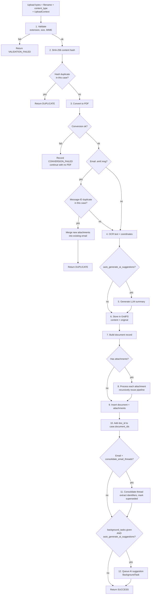
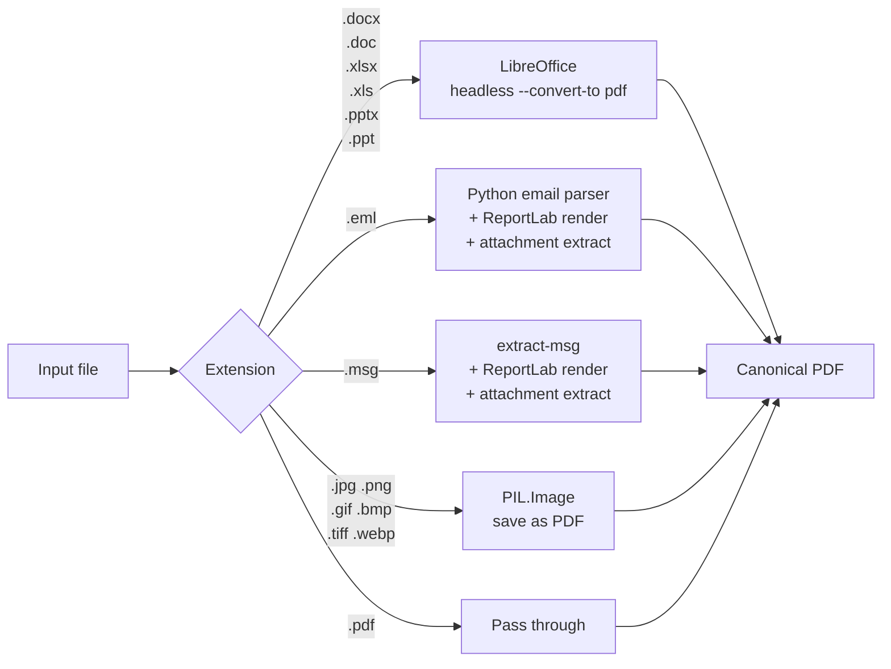

# Document Processing

**Status:** Active
**Applies to:** `0.1.x`
**Primary source:** `backend/src/documents/processing_service.py`

Every document upload in BlackBar flows through a single service —
`DocumentProcessingService` — regardless of which router accepted the
upload. That service owns validation, deduplication, conversion, OCR,
optional AI summary, GridFS storage, attachment processing, email
thread consolidation, and (optionally) queueing background AI
suggestion generation.

The three upload entry points are:

| Route                                         | Auth                | Notes                          |
|-----------------------------------------------|---------------------|--------------------------------|
| `POST /api/v1/documents/`                     | JWT (org/admin)     | Authenticated staff upload     |
| `POST /api/v1/cases/collect/{token}/upload`   | Public link token   | Anonymous collection link      |
| `POST /api/v1/contribute/{contributor_id}/upload` | Magic-link token | Named contributor              |

All three construct an `UploadContext` and delegate to
`DocumentProcessingService.process_upload`.

---

## 1. Pipeline overview



Each numbered step corresponds to a method on the service; see the
source for line-by-line behaviour.

---

## 2. Inputs

```python
@dataclass
class UploadContext:
    case_id: Optional[str] = None
    uploaded_by: str = "system"
    uploaded_by_name: str = "System"

    # Contributor uploads
    contributor_id: Optional[str] = None
    contributor_name: Optional[str] = None

    # Collection-link uploads
    collection_link_id: Optional[str] = None
    submitter_name: Optional[str] = None
    submitter_email: Optional[str] = None
    submitter_notes: Optional[str] = None

    # Processing toggles
    process_attachments: bool = True
    consolidate_email_threads: bool = True
```

The service treats all uploads identically; only the metadata
attached to the resulting document record differs.

---

## 3. Validation

| Check       | Source                              |
|-------------|-------------------------------------|
| Extension   | `ALLOWED_EXTENSIONS` (16 types)     |
| MIME type   | `ALLOWED_MIME_TYPES`                |
| Size limit  | `MAX_FILE_SIZE = 100 MB`            |

Allowed extensions: `.pdf .doc .docx .xls .xlsx .ppt .pptx .eml .msg
.jpg .jpeg .png .gif .bmp .tiff .tif .webp`.

A validation failure returns `ProcessingStatus.VALIDATION_FAILED`
without writing anything to storage.

---

## 4. Deduplication

Two checks, both scoped to the upload's `case_id` (or unscoped if
none):

1. **Content hash.** SHA-256 of the original bytes. Computed before
   conversion to short-circuit identical re-uploads.
2. **Email Message-ID.** Extracted from the RFC 5322 headers during
   EML/MSG conversion. If a matching email is already in the same
   case, any *new* attachments from this upload are merged into the
   existing email document instead of creating a new record.

Both checks return `ProcessingStatus.DUPLICATE` with
`duplicate_of_id` and `duplicate_of_filename` populated.

Case-scoped duplicate detection means the same source file can exist
across different cases without false positives — this is intentional
(see audit notes).

---

## 5. Conversion to PDF



Dispatch lives in `backend/src/utils/conversion.py`
(`convert_to_pdf`). For office documents the service shells out to a
LibreOffice headless instance bundled in the backend container. EML
and MSG conversion extracts attachments as a side product; those flow
into step 8 of the pipeline.

If conversion fails the document is still recorded with
`conversion_status="not_needed"` and the original bytes only — this
keeps a trail rather than dropping uploads silently.

---

## 6. OCR and text extraction

`_extract_text` delegates to `extract_text_with_coordinates` (currently
re-exported from `documents/routes.py`; see audit note B-xx for the
intended extraction to a util). PyMuPDF is the primary extractor; the
service falls back to Tesseract OCR for pages that PyMuPDF reports as
image-only.

Output is a `text_data` dict carrying:

- `full_text` — concatenated string (truncated at 500K chars)
- `pages` — page-level entries with word-level bounding boxes
  (truncated at 50 pages)

The truncation flag (`text_data.truncated = true`) is set whenever
either limit triggers. Truncation exists because MongoDB documents are
capped at 16 MB; very large PDFs would otherwise refuse to insert.

A `text_summary` (short heuristic preview) is stored alongside.

---

## 7. AI summary (optional)

Controlled by `system_config.auto_generate_ai_suggestions`. When
enabled, the service calls `generate_document_summary` which routes
the canonical PDF through the configured LLM provider. The summary is
stored on the document as `summary`. Failure is logged and ignored —
the document still saves.

---

## 8. GridFS storage

Binaries are stored in GridFS via the synchronous `pymongo` client
(GridFS doesn't have a stable async API in Motor). Two file objects
may be created per upload:

| Field                            | Contents                                    |
|----------------------------------|---------------------------------------------|
| `document.content_file_id`       | Canonical PDF (or original if no conversion)|
| `document.original_file_id`      | Original file, when conversion happened     |

GridFS keeps document records small (well under the 16 MB document
limit) and lets the backend stream binaries on demand.

---

## 9. Document record

The service builds the record as a plain dict (richer than the
`DocumentDB` Pydantic model) and inserts it directly. See
[`DATA_MODELS.md`](DATA_MODELS.md) §5 for the full effective schema.
Key derived fields:

- `processing_status` — `ocr_complete` if `text_data` was produced,
  else `pending`
- `conversion_status` — `converted` if a non-PDF was turned into a
  PDF, else `not_needed`
- `case_id` — copied from `UploadContext`
- Email-specific: `message_id`, `original_mime_type`,
  `converted_mime_type`

If a `case_id` is provided, the new document's `id` is also pushed
onto `cases.document_ids` via `$addToSet`.

---

## 10. Attachment processing

When EML/MSG conversion yields attachments, each one is run through
the same pipeline (`_process_attachments` → convert + OCR + summary +
GridFS) and stored as its own document with:

- `is_attachment: true`
- `parent_document_id: <email document id>`
- Same `case_id` as the parent

The parent email's `attachment_ids`, `has_attachments`, and
`total_attachments` are then populated.

A separate `_merge_attachments_into_email` path runs when a duplicate
email is uploaded with *new* attachments: only the new attachments are
processed and appended to the existing email's `attachment_ids`.

---

## 11. Email thread consolidation

When `UploadContext.consolidate_email_threads` is true (default), the
service:

1. Extracts thread identifiers (`References`, `In-Reply-To`, normalised
   subject) from the email body using `extract_thread_identifiers`.
2. Finds related emails in the same case via `find_thread_emails`.
3. Marks older emails in the thread as superseded and records the
   relationship via `consolidate_email_thread`.

This logic is delegated to helpers currently in
`backend/src/documents/routes.py` (planned for extraction to a
dedicated `email_threads` util).

---

## 12. Background AI suggestion task

If the caller passed a FastAPI `BackgroundTasks` *and*
`system_config.auto_generate_ai_suggestions` is true, the service:

1. Reads `ai_suggestion_timeout` (default 120 s) from
   `system_config.id="global_ai_settings"`.
2. Flips the document's `processing_status` to `ai_queued`.
3. Adds `generate_ai_suggestions_async(document_id, timeout, db)` to
   the background task queue.

The async task moves the status through `ai_processing` → either
`ai_complete` (suggestions cached with coordinates) or `ai_timeout` /
`ai_error`. The frontend polls the document for status while it
renders the viewer.

---

## 13. Result types

```python
class ProcessingStatus(str, Enum):
    SUCCESS = "success"
    DUPLICATE = "duplicate"
    CONVERSION_FAILED = "conversion_failed"
    VALIDATION_FAILED = "validation_failed"
    ERROR = "error"

@dataclass
class ProcessingResult:
    status: ProcessingStatus
    document_id: Optional[str]
    filename: Optional[str]
    message: str
    is_duplicate: bool
    duplicate_of_id: Optional[str]
    duplicate_of_filename: Optional[str]
    conversion_status: str
    has_ocr: bool
    has_ai_summary: bool
    attachment_count: int
    attachment_ids: List[str]
    thread_consolidation: Optional[Dict]
    warnings: List[str]
    error: Optional[str]
```

Callers translate `status` into HTTP responses. The authenticated
upload route, for example, maps `DUPLICATE` to 200 with a duplicate
indicator and `VALIDATION_FAILED` to 400.

---

## 14. Related documentation

- [`ARCHITECTURE.md`](ARCHITECTURE.md) — system overview
- [`DATA_MODELS.md`](DATA_MODELS.md) — document record schema
- [`SECURITY_ARCHITECTURE.md`](SECURITY_ARCHITECTURE.md) — upload-route
  auth surfaces
