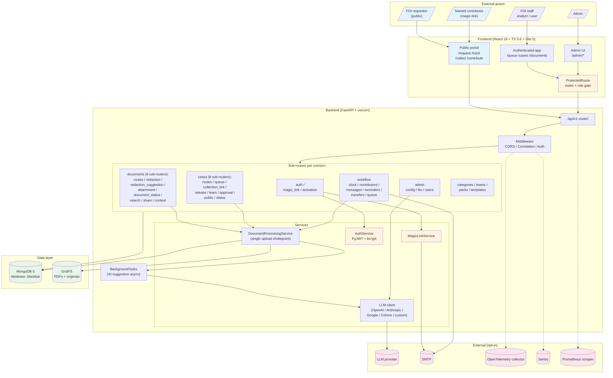
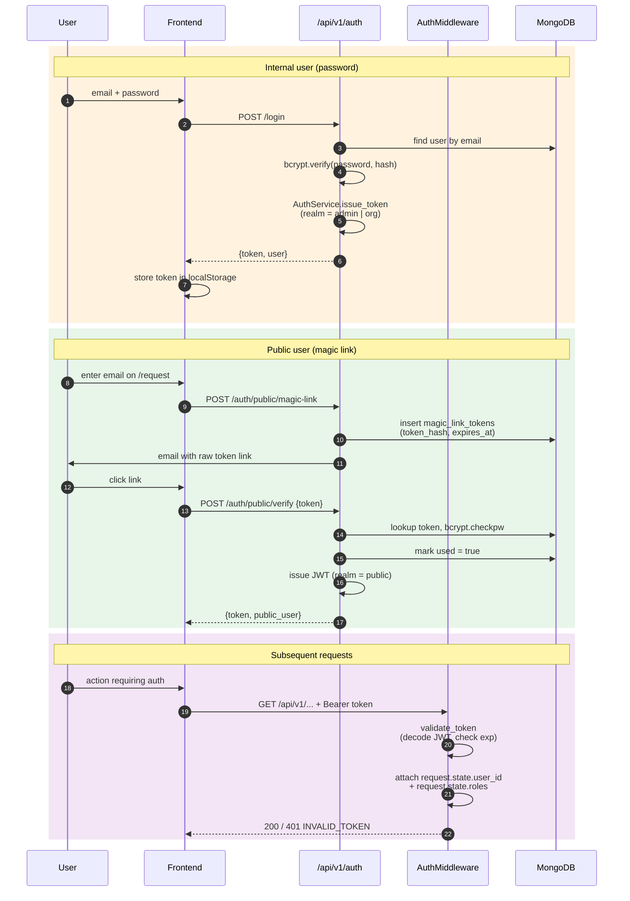
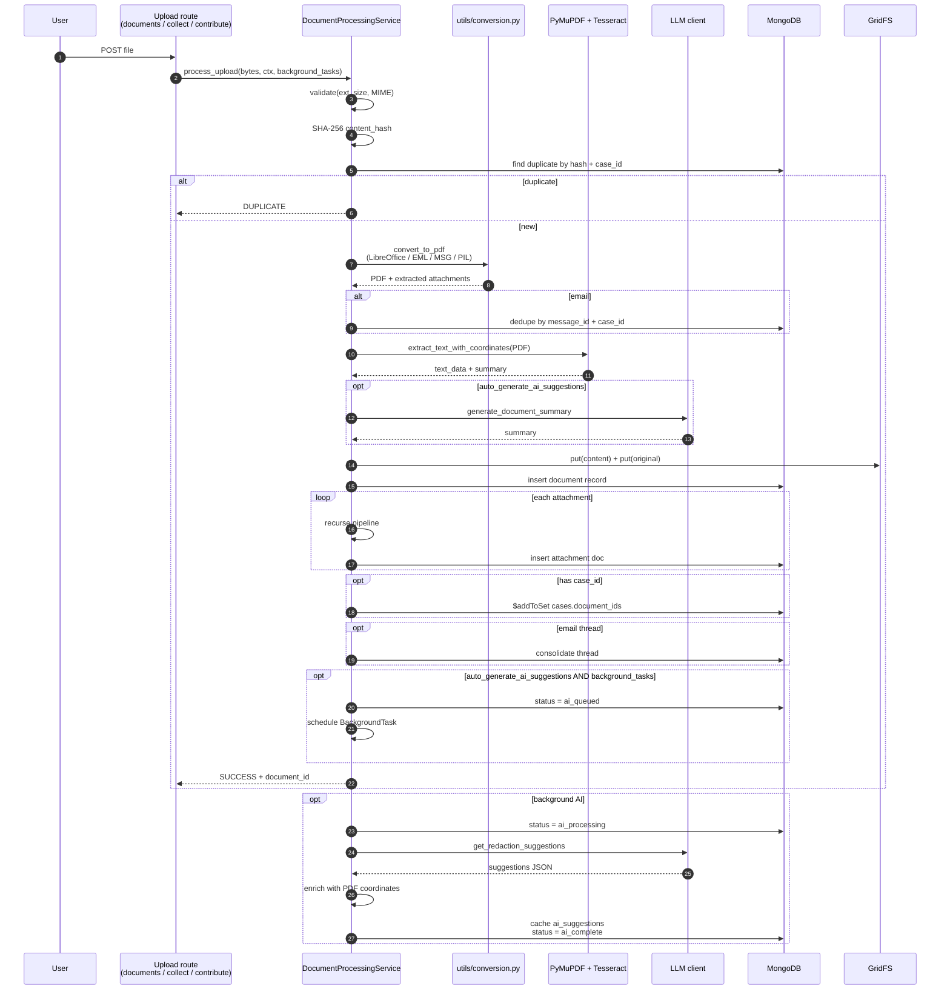
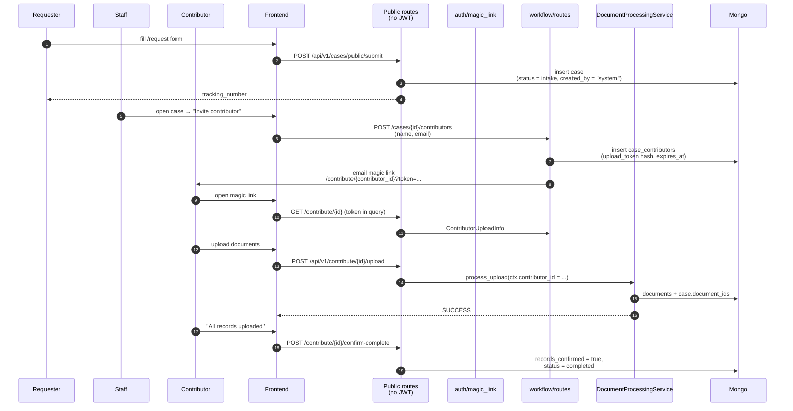
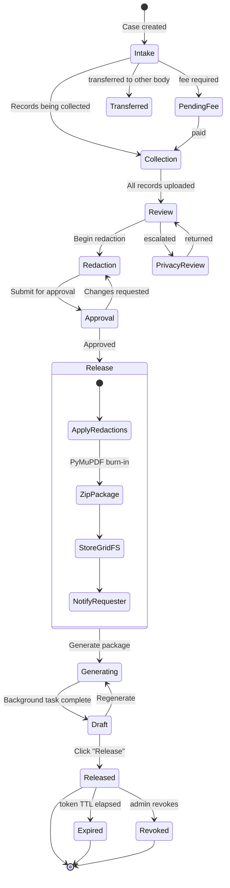

# System Overview Diagram

**Status:** Active
**Applies to:** `0.1.x`

A single consolidated Mermaid diagram showing how BlackBar's pieces
fit together. Use this as the visual jumping-off point; the prose
detail lives in the surrounding architecture docs.

For deeper coverage, see:

- [`ARCHITECTURE.md`](ARCHITECTURE.md)
- [`DATA_MODELS.md`](DATA_MODELS.md)
- [`DOCUMENT_PROCESSING.md`](DOCUMENT_PROCESSING.md)
- [`SECURITY_ARCHITECTURE.md`](SECURITY_ARCHITECTURE.md)

---

## Top-level system map

---

## Authentication flow (login + magic link)

---

## Document processing pipeline

---

## Public portal flow (magic-link contributor uploads)

---

## Release flow (redaction → release package → download)

---

## Notes

- Diagrams render natively on GitHub. No external rendering or
  `.excalidraw` files are used in this project.
- If a diagram drifts from the source, the source is canonical — open
  an issue or send a doc PR.
