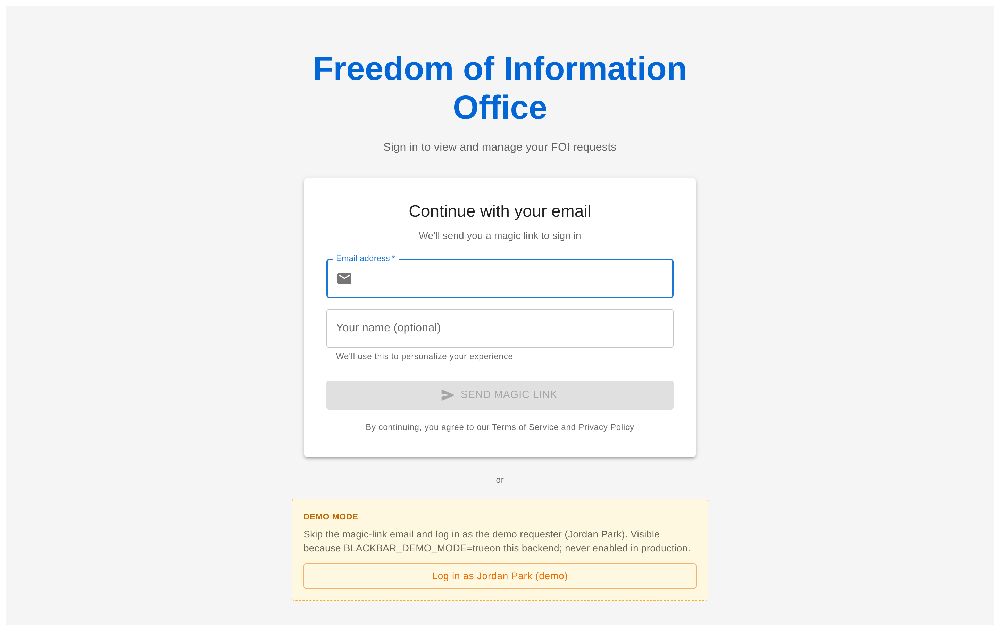
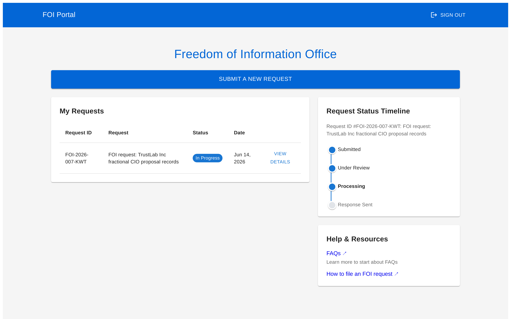
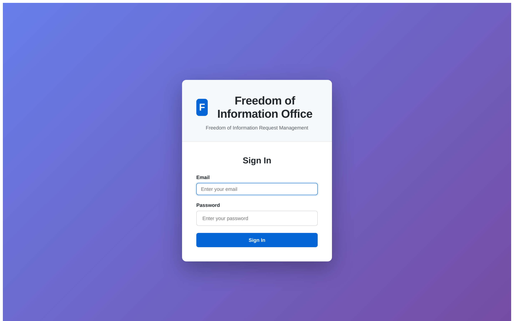
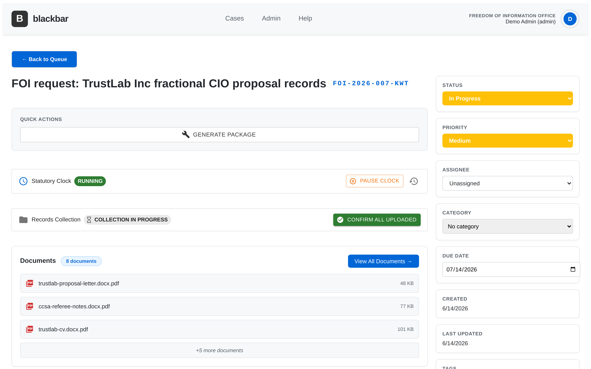
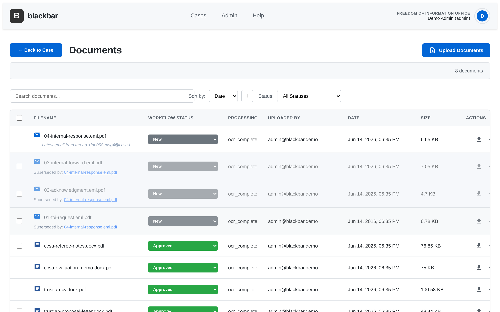
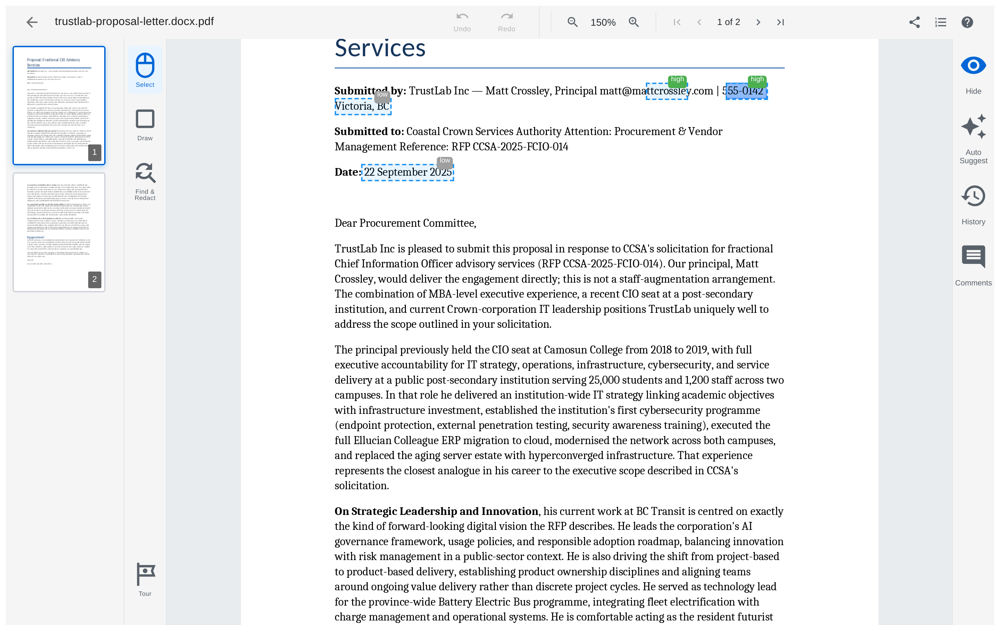
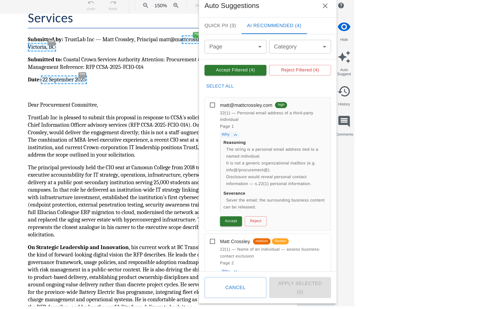
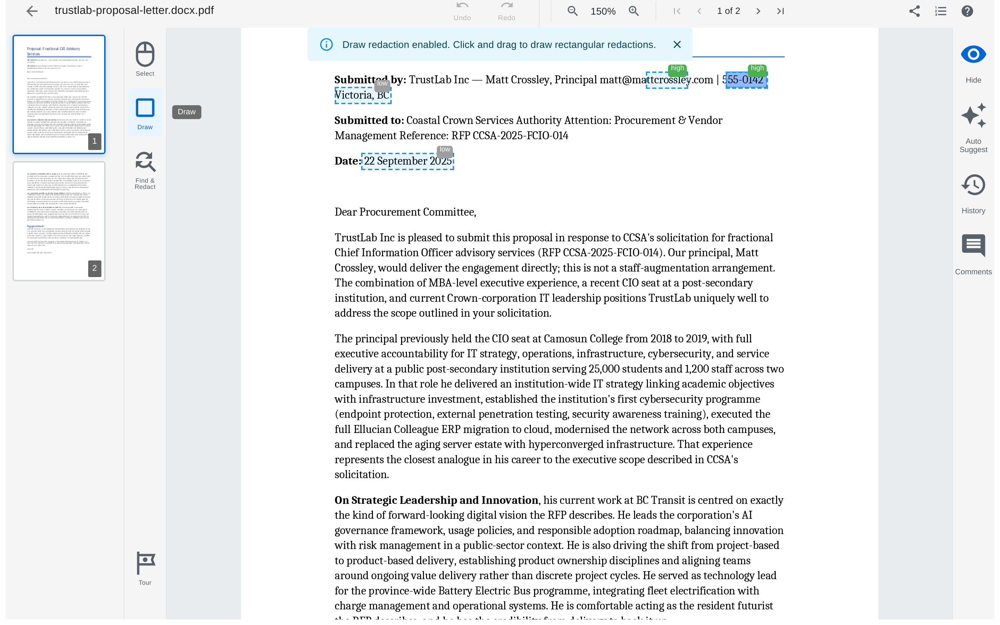
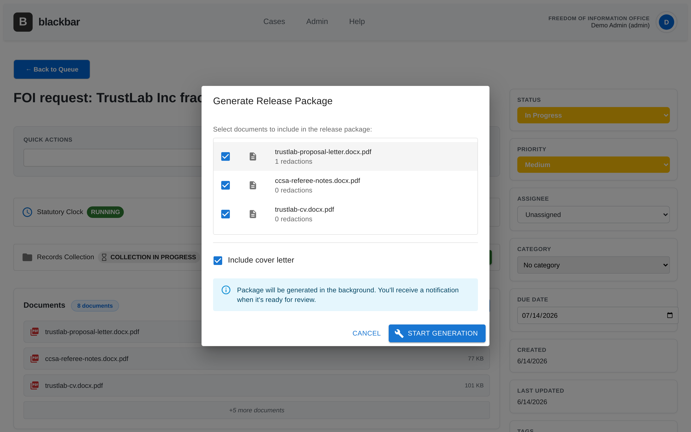

# Screenshots

A guided tour of BlackBar's core flows. These are captured against the seeded
demo data; regenerate them any time with
[`scripts/demo_screenshots.sh`](../../scripts/demo_screenshots.sh).

## Requester-facing

### Public login (demo mode)
One-click "Log in as Jordan Park" appears only when `BLACKBAR_DEMO_MODE=true`.

### Requester portal
Requesters track their FOI requests and see a status timeline.

## Staff workspace

### Staff sign-in

### Case queue
Every case with status, priority, assignee, and colour-coded due dates.

### Case detail
Statutory clock, records collection, and the document set for a case.

### Document list — email-thread deduplication
Uploaded email threads are consolidated: the latest message is kept and older
replies are marked **superseded**, so reviewers don't redact the same content
repeatedly.

## Document viewer & redaction

### Viewer with AI suggestion overlays
The rendered document with AI-suggested redactions highlighted inline.

### AI redaction suggestions
Suggestions classified under FOIPPA s.22 (personal information), with confidence.

### Suggestion reasoning
Each suggestion can show its reasoning chain and a severance note.

### Manual redaction
Draw rectangular redactions directly on the page.

### Redacted preview
Toggle the eye to preview the final output — content burned out as black bars.

## Release

### Generate release package
Select documents (redaction counts shown) and produce the package for the requester.

